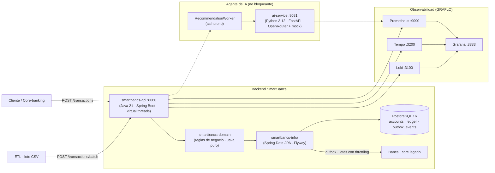

# SmartBancs App

> **Reto técnico de ingeniería · NextGen Engineering**
> Plataforma financiera transaccional en tiempo real con recomendaciones
> personalizadas por IA, integrada con el core legado `Bancs`.

SmartBancs procesa **transacciones en tiempo real** y genera **recomendaciones
financieras personalizadas** impulsadas por IA, sin que la IA bloquee jamás el
flujo transaccional principal.

---

## Índice

1. [Resumen ejecutivo](#1-resumen-ejecutivo)
2. [Video demostrativo](#2-video-demostrativo)
3. [Estado del entregable](#3-estado-del-entregable)
4. [Stack tecnológico](#4-stack-tecnológico)
5. [Arquitectura](#5-arquitectura)
6. [Estructura del repositorio](#6-estructura-del-repositorio)
7. [Puesta en marcha (MVP con Docker)](#7-puesta-en-marcha-mvp-con-docker)
8. [Agente de IA (recomendaciones)](#8-agente-de-ia-recomendaciones)
9. [Observabilidad](#9-observabilidad)
10. [ETL / carga a data warehouse](#10-etl--carga-a-data-warehouse)
11. [Demo y evidencia](#11-demo-y-evidencia)
12. [Ejecución sin Docker (desarrollo)](#12-ejecución-sin-docker-desarrollo)
13. [Documentación técnica](#13-documentación-técnica)
14. [Modelo de dominio](#14-modelo-de-dominio)
15. [Flujo de trabajo Git](#15-flujo-de-trabajo-git)
16. [Formato de entrega](#16-formato-de-entrega)
17. [Licencia y autor](#17-licencia-y-autor)

---

## 1. Resumen ejecutivo

| | |
| --- | --- |
| **Alta concurrencia** | Soporta picos de **10 000 transacciones por segundo** |
| **Latencia** | Transferencia completada en **menos de 2 segundos** |
| **Integración segura** | Se conecta al core legado **`Bancs` sin degradar su rendimiento** |
| **IA no bloqueante** | Las recomendaciones de IA **nunca** entorpecen el flujo transaccional |

> **Autoría y uso de IA.** Las secciones/funciones comprendidas entre la
> **observabilidad** y la **sección del agente de IA** se generaron con el apoyo
> de **Big Pickle** (agente de codificación de **opencode**) y la estructura del
> **mock** se diseñó con el **agente de planificación** de opencode. Es parte de
> la estrategia para documentar la **autoría del backend**: el candidato
> revisa, compila, ejecuta y verifica cada pieza; la IA actúa como apoyo de
> programación. Detalle: [`docs/DECLARACION_IA.md`](docs/DECLARACION_IA.md).

**Entregables del reto:** documento técnico, MVP ejecutable en un repositorio
Git, instrucciones de ejecución, evidencia de funcionamiento, video
demostrativo y declaración de uso de IA.

## 2. Video demostrativo

<!-- Video demostrativo de la solución (enlace de Drive) -->
| Formato | Enlace |
| --- | --- |
| Video demostrativo | [Video demostrativo](https://drive.google.com/drive/folders/1jb0co0URvDmLIChGstfGOVCwTHJL7wLt?usp=sharing) |

> Sugerencia de contenido (3–5 min): CRUD de clientes/cuentas → depósito →
> transferencia con idempotencia → ledger e invariante contable → observabilidad
> (Grafana/Prometheus: métricas, trazas y alertas SLO) → agente de IA
> (recomendación recibida sin bloquear la transacción) → evidencia generada por
> `./scripts/demo.sh`.

## 3. Estado del entregable

| Etapa | Estado |
| --- | --- |
| Bootstrap del proyecto (devcontainer, estructura, modelo de dominio) | ✅ Hecho |
| MVP local con Docker Compose (PostgreSQL + API + IA + observabilidad) | ✅ Hecho |
| Núcleo de negocio (arquitectura en 3 capas) | ✅ Hecho |
| Acceso a datos + esquema PostgreSQL (Flyway) | ✅ Hecho |
| REST CRUD: customers, accounts, transactions + transferencias y ledger | ✅ Hecho |
| Idempotencia, concurrencia (`FOR UPDATE` / `@Version`) e invariante contable | ✅ Hecho |
| ETL / carga a data warehouse | ✅ Hecho |
| Ingesta por lotes (`POST /transactions/batch`) | ✅ Hecho |
| Agente de IA asíncrono (no bloqueante) | 🟡 Funcional (mock + OpenRouter) |
| Observabilidad (métricas · logs · trazas · alertas) | ✅ Hecho |
| Documentación final + evidencia | ✅ Hecho |
| Video demostrativo | ✅ Publicado en la nube (enlace en §2) |

## 4. Stack tecnológico

| Capa | Tecnología |
| --- | --- |
| API transaccional | **Java 21** (virtual threads) + **Spring Boot 3** / Maven (multimódulo: `domain`, `infra`, `api`) |
| Agente de IA | **Python 3.12** + **FastAPI** (uvicorn) — servicio independiente y asíncrono |
| Base de datos | **PostgreSQL 16** + **Flyway** (migraciones versionadas) |
| Entorno local | **Docker** + **Docker Compose** (infraestructura como código) |
| Entorno de desarrollo | **Devcontainer** reproducible (JDK 21 + Maven + Docker) |
| Observabilidad | **Prometheus**, **Tempo** (OTLP), **Loki** + **Promtail** y **Grafana** provisionada |
| Despliegue (AWS) | **Terraform** → **instancias EC2** corriendo las **imágenes Docker** del repo · **GitHub Actions** (OIDC) |

## 5. Arquitectura



**Decisiones de diseño** (justificadas en [`docs/ARQUITECTURA.md`](docs/ARQUITECTURA.md)):

- **Patrón outbox** para integrar con `Bancs`: la transacción se confirma solo
  contra PostgreSQL y un *relayer* entrega eventos a Bancs en lotes (sin
  llamadas síncronas al core).
- **Concurrencia segura**: `SELECT … FOR UPDATE` (bloqueo por fila) + `@Version`
  (optimista) e idempotencia por clave — evitan condiciones de carrera y doble gasto.
- **IA nunca en el camino crítico**: el agente de IA corre como servicio
  separado y se consume de forma asíncrona.

> Diagrama profesional descargable (PlantUML, componentes + secuencia de la
> transferencia): [`docs/arquitectura.puml`](docs/arquitectura.puml) — ábrelo en
> plantuml.com, VS Code (extensión PlantUML) o tu IDE favorito. Versión en texto
> ASCII dentro de [`docs/ARQUITECTURA.md`](docs/ARQUITECTURA.md).

**Capacidad, redundancia y no pérdida de datos (resumen)** — detalle completo en
[`docs/ARQUITECTURA.md` §7.1](docs/ARQUITECTURA.md):

- El objetivo de **≥ 10 000 transacciones** se cubre replicando las capas **sin
  estado** (`api` + `ai-service`) detrás de un **ALB**, manteniendo una
  **única PostgreSQL ACID** y el worker de outbox activo solo en el primario
  (`SMARTBANCS_AI_WORKER_ENABLED=false` en la réplica). Activación:
  `terraform apply -var="redundancy_enabled=true"`.
- La EC2 usa una **dirección elástica (Elastic IP)**: la URL pública no cambia
  aunque la instancia se sustituya (cero pérdida de conectividad/datos del lado
  del cliente).
- La BBDD persiste en un **volumen EBS dedicado** montado en `/var/lib/docker`
  (xfs + fstab): sobrevive a reboots y sustituciones; backups `pg_dump` en
  `s3://smartbancs-tfstate/deploy/backups/`.

## 6. Estructura del repositorio

```
RetoTCs/
├─ .devcontainer/          # Entorno reproducible (JDK 21 + Maven + Docker)
├─ smartbancs-api/         # API Spring Boot: controllers, DTOs, servicios, errores, métricas
├─ smartbancs-domain/      # Entidades, enums y reglas de negocio (Java puro, sin Spring)
├─ smartbancs-infra/       # Acceso a datos, Flyway, repositorios, clientes IA/Bancs
├─ ai-service/             # Agente de IA: Python/FastAPI (OpenRouter + mock avanzado), independiente
├─ etl/                    # ETL: transformación + ingesta por lote + fact table
├─ scripts/                # demo.sh (evidencia reproducible) · aws-configure.sh
├─ docs/                   # Documentación técnica (en español · incluye arquitectura.puml)
├─ observability/          # Prometheus · Tempo · Loki · Promtail · Grafana (provisionada)
├─ terraform/              # IaC para AWS: EC2 + ECR + SSM (tfvars de ejemplo incluidos)
├─ deploy/                 # ec2_bootstrap.sh.tpl — user-data de arranque de la EC2
├─ docker-compose.yml      # MVP local: PostgreSQL + api + ai-service + observabilidad
└─ docker-compose.prod.yml # Override de producción: imágenes desde ECR (build: !reset)
```

## 7. Puesta en marcha (MVP con Docker)

**Prerrequisito:** Docker con el plugin de Compose.

**1. Configura el entorno (opcional):**

```bash
cp .env.example .env        # edita credenciales si quieres (OPCIONAL)
```

> La IA queda operativa **con o sin API key**: si `OPENROUTER_API_KEY` está
> vacía, el agente usa un **mock avanzado y funcional** (`source="mock"`); si le
> pones tu token de [OpenRouter](https://openrouter.ai/keys), llama al modelo
> real `moonshotai/kimi-k2.6` (`source="openrouter"`).

**2. Construye y levanta el stack:**

```bash
docker compose up --build -d
```

**3. Verifica que todo esté `healthy`:**

```bash
docker compose ps
```

Deben quedar `healthy` (o `Up`) los servicios. Si algo quedó mal, revisa los
logs del servicio: `docker compose logs -f <servicio>` (p. ej. `api`,
`ai-service`, `prometheus`).

**4. Comprueba la salud de los componentes clave:**

```bash
curl -s http://localhost:8080/actuator/health      # API (Spring Boot)
curl -s http://localhost:8081/health               # Agente de IA (FastAPI)
# Abre la documentación interactiva en el navegador:
#  API   → http://localhost:8080/swagger-ui.html
#  IA    → http://localhost:8081/docs
```

**5. Flujo del reto, paso a paso (recorrido de demostración).** Con Swagger UI o
`curl`, sigue este orden para cubrir lo exigido por el reto:

1. **Cliente**: `POST /customers` → toma el `id`.
2. **Cuenta**: `POST /accounts` (`customerId`, moneda, saldo inicial) → copia
   `id` y `accountNumber`.
3. **Depósito**: `POST /transactions` (`type=DEPOSIT`, `amount`, `currency`,
   `idempotencyKey` única). Responde `201` **sin esperar a la IA** (no bloqueante).
4. **Transferencia**: `POST /transactions` (débito → crédito) y reusa la misma
   `idempotencyKey` para ver la idempotencia (misma transacción, no se duplica).
5. **Ledger**: `GET /transactions/{id}/ledger` → dos legs DEBIT/CREDIT.
6. **Recomendación IA (asíncrona)**: espera ~10–15 s (outbox + worker) y llama
   `GET /recommendations?customerId={cliente}` → recomendación `READY` con
   `category`, `message` (qué hacer, como lo haría la entidad bancaria),
   `priority`, `insights` y `actions`.
7. **ETL por lotes** (opcional): `POST /transactions/batch` (ver §10).
8. **Observabilidad**: Grafana `http://localhost:3333` (`admin`/`admin`) →
   dashboard **"SmartBancs – Observabilidad"**; métricas en `:9090`, trazas en
   `:3200`, logs en `:3100`.
9. **Evidencia reproducible**: `./scripts/demo.sh` (ver §11).

**5.1 Puertos de la solución (servicios y observabilidad):**

| Servicio | Puerto local |
| --- | --- |
| API (Spring Boot) · health `:8080/actuator/health` | `8080` |
| Agente de IA (FastAPI) · health `:8081/health` | `8081` |
| PostgreSQL (db/usuario `smartbancs`) | `5432` |
| **Grafana** (dashboards + alertas) | `3333` |
| **Prometheus** (métricas) | `9090` |
| **Tempo** (trazas OTLP; también `4317`/`4318`) | `3200` |
| **Loki** (logs) | `3100` |
| postgres-exporter | `9187` |

**5.2 Despliega en AWS (Terraform + EC2).** El mismo stack —las **imágenes
 Docker** del repositorio— se despliega en **instancias EC2** de AWS con
 **Terraform**; el security group expone para la demo: **API `:8080`**, agente
 de IA `:8081`, **Grafana `:3333`**, Prometheus `:9090`, Tempo `:3200`, Loki
 `:3100` y postgres-exporter `:9187` (accesibles por la IP pública de la
 instancia). Requiere GitHub Actions con OIDC y el secret `OPENROUTER_API_KEY`
 (se inyecta por SSM en la EC2 al arrancar). Comandos y detalle en
 [`terraform/`](terraform), en el
 workflow [`.github/workflows/terraform-ci.yml`](.github/workflows/terraform-ci.yml)
 y en la sección *Despliegue en AWS* de
 [`docs/ARQUITECTURA.md`](docs/ARQUITECTURA.md).

> **Free Plan (esta cuenta).** Creada tras jul-2025, este *Free Plan* solo
> permite lanzar `t3.micro`, `t3.small`, `t4g.*`, `c7i-flex.large` y
> `m7i-flex.large` (default elegido: `m7i-flex.large`); cualquier otro tipo
> (p. ej. `t3.medium`) falla con *"The specified instance type is not eligible
> for Free Tier"*.
> **Modelo real vs mock.** Sin el secret `OPENROUTER_API_KEY` el stack igual
> levanta y la IA responde en modo `mock` (el parámetro SSM no se crea). Para
> usar OpenRouter en la EC2: añade el secret en GitHub → `Actions → terraform
> deploy → Run workflow` (recreará la EC2 inyectando el SecureString por SSM).

**6. Detén el stack:**

```bash
docker compose down            # apaga servicios
docker compose down -v         # apaga y borra los volúmenes (datos)
```

> **Docker rootless (Linux).** Dos ajustes posibles:
>
> **1. `promtail` no encuentra el daemon** (error `creating mount source path
> '/var/lib/docker/containers'`): en rootless el socket y los contenedores no
> están en las rutas por defecto. Exporta antes de `docker compose up`
> (o ponlos en `.env`, está en `.gitignore`):
>
> ```bash
> export DOCKER_SOCKET=/run/user/$UID/docker.sock
> export DOCKER_CONTAINERS_DIR=$HOME/.local/share/docker/containers
> ```
> Verifica las rutas reales con `docker info | grep "Docker Root Dir"`.
>
> **2. Egreso de contenedores roto (timeouts a internet).** Síntoma: el agente
> de IA cae a `source: "mock"` aun teniendo `OPENROUTER_API_KEY`, porque el
> `httpx.ConnectTimeout` a OpenRouter nunca se resuelve. Ocurre con
> **slirp4netns** (driver de red por defecto de rootless) en kernels recientes
> (p. ej. 7.x). La solución es cambiar el driver rootless a **pasta**
> (`passt`), soportado nativamente por rootlesskit ≥ 3.1:
>
> ```bash
> sudo pacman -S passt          # Arch/Manjaro (en otras distros busca "passt")
> ```
>
> ```ini
> # ~/.config/systemd/user/docker.service.d/override.conf
> [Service]
> Environment="DOCKERD_ROOTLESS_ROOTLESSKIT_NET=pasta"
> Environment="DOCKERD_ROOTLESS_ROOTLESSKIT_PORT_DRIVER=implicit"
> ```
>
> ```bash
> systemctl --user daemon-reload && systemctl --user restart docker
> ```
>
> Diagnóstico rápido: si un contenedor cualquiera puede resolver DNS pero todo
> TCP externo muere (`docker run --rm python:3.12-alpine python -c "import
> socket; socket.setdefaulttimeout(6); socket.create_connection(('1.1.1.1',
> 443))"` → `TimeoutError`), es este problema y no del stack.

## 8. Agente de IA (recomendaciones)

El agente de IA vive en **`ai-service`** (**Python 3.12 + FastAPI**) como
servicio **independiente y asíncrono**: la API nunca lo espera en el flujo de
una transacción.

| Endpoint | Descripción |
| --- | --- |
| `POST /internal/recommendations` | Genera una recomendación a partir del contexto transaccional (endpoints `async`, no bloquean el event loop) |
| `GET /health` | Healthcheck (usado por Docker) |
| `GET /metrics` | Métricas Prometheus `smartbancs_ai_*` (peticiones, recomendaciones, errores, latencia) |
| `GET /docs` | Documentación interactiva de FastAPI |

**Proveedores.** Si existe `OPENROUTER_API_KEY` consulta a **OpenRouter**
(`httpx.AsyncClient`); sin API key o ante un error del proveedor cae a un
**mock avanzado** (reglas heurísticas con `source="mock"`), por lo que la demo
funciona siempre.

**Desde la API.** `GET /recommendations?customerId={uuid}&limit=20` devuelve las
recomendaciones generadas de forma asíncrona para un cliente (persistidas tras
la transacción vía worker/outbox).

> Variables de entorno: `OPENROUTER_API_KEY`, `AI_MODEL` (por defecto
> `moonshotai/kimi-k2.6`), `AI_HTTP_TIMEOUT`, `LOG_LEVEL`.

**Contrato de respuesta (lo que el reto espera que conteste la IA).** El agente
recibe el **contexto (DTO de entrada)**: movimiento (`type`, `amount`,
`currency`, saldos posteriores) **más información general del cliente**
(`customerSegment`: RETAIL/PREMIUM/CORPORATE y `accountAgeDays`), y devuelve una
**decisión financiera estandarizada (DTO de salida)** — lo que el cliente
**debería hacer**, como lo haría la entidad bancaria — en un único JSON:
`category` (normalizado: `savings` · `spending` · `transfer` · `risk` ·
`generic`), `message` (consejo legible en español, específico y consciente del
riesgo PEN/USD), `priority` (`LOW`/`MEDIUM`/`HIGH`), `insights` (razonamiento,
≤10) y `actions` (**acciones concretas sugeridas**, 1–5), más
`recommendationId`, `customerId`, `model`, `source` (`openrouter`|`mock`) y
`generatedAt`. La salida pasa por una **normalización** en
`ai-service/app/providers.py`, así la API siempre contesta el mismo esquema con
valores acotados (sea el modelo real o el mock), lo que hace el consumo óptimo y
predecible.

**CI con el token (GitHub Actions).** El workflow
[`.github/workflows/ai-service.yml`](.github/workflows/ai-service.yml) levanta
el `ai-service` y ejecuta `ai-service/smoke_test.py`. Para que la llamada sea
**real a OpenRouter**, crea un secret en el repositorio con el nombre
`OPENROUTER_API_KEY` (Settings → Secrets and variables → Actions →
New repository secret) y el workflow validará que la IA conteste con
`source="openrouter"`; sin secret valida el fallback (`source="mock"`).
También puedes correrlo local: `EXPECTED_SOURCE=mock python3 ai-service/smoke_test.py`.

## 9. Observabilidad

Se levanta con el mismo `docker compose` y queda integrado **Prometheus**
(métricas), **Tempo** (trazas OTLP) y **Loki** (logs JSON) en **Grafana**
(provisionada con datasources y dashboard **"SmartBancs – Observabilidad"**).

| Señal | Cómo se captura |
| --- | --- |
| Métricas | `http://localhost:8080/actuator/prometheus` (API) · `http://localhost:8081/metrics` (agente de IA) |
| Negocio | `smartbancs_transactions_total` · `smartbancs_transaction_duration_seconds` · `smartbancs_transaction_amount_*` |
| IA | `smartbancs_ai_requests_total` · `smartbancs_ai_recommendations_total` · `smartbancs_ai_duration_seconds` |
| Trazas y logs | Correlacionadas por `traceId`; en Grafana → Explore saltas del log a la traza en Tempo |
| Alertas SLO | 8 reglas en `observability/prometheus/rules.yml`: instancia caída, latencia, tasa de error, timeouts/esperas del pool Hikari, deadlocks y conexiones de PostgreSQL |

**Validado en vivo:** la pila genera métricas, trazas y logs correlacionados
por `traceId`; las 8 reglas de alerta están cargadas y evaluando en Prometheus.

Detalle completo (arquitectura, instrumentación, queries y troubleshooting):
[`docs/OBSERVABILIDAD.md`](docs/OBSERVABILIDAD.md).

## 10. ETL / carga a data warehouse

Proceso que recibe un **lote de datos crudos (no homologados)** desde un
archivo, los limpia/estandariza y los ingesta como transacciones reales a
través de la API, además de dejar una **fact table** optimizada para análisis
y modelos de IA.

**Componentes:**

- `etl/sample-data/raw_transactions.csv` — lote de muestra *sin procesar*:
  montos con comas/decimales (`"1,250.50"`, `"750,00"`, `"$2,500.00"`), monedas
  en minúsculas/espaciadas, fechas en formatos mixtos, nulos, montos negativos,
  tipos desconocidos, filas duplicadas (idempotencia), cuentas inexistentes y un
  caso de fondos insuficientes.
- `etl/etl_transform.py` — ETL en **Python estándar** (sin dependencias
  externas), no añade servicios nuevos al despliegue.
- `POST /transactions/batch` — endpoint de ingesta que resuelve
  `accountNumber` → `accountId` y aplica las **mismas reglas** que
  `POST /transactions`, tolerando errores parciales (`accepted`/`rejected` por
  ítem).

**Pipeline:**

```text
EXTRACT   csv.DictReader + mapeo de columnas (headings sucios)
TRANSFORM Normalización: tipo · monto · ISO-4217 · fecha ISO · nulos
DEDUP     idempotencyKey determinístico (evita duplicados)
RESOLVE   GET /accounts → accountNumber → accountId
LOAD      POST /transactions/batch (chunks de 50)
ANALYZE   transactions_fact.csv (unidades menores enteras) + etl_report.json
```

**Uso:**

```bash
# Solo transformar/reportar (sin publicar nada):
python3 etl/etl_transform.py --input etl/sample-data/raw_transactions.csv --dry-run

# Carga real contra el stack local:
docker compose up -d            # postgres + api arriba
python3 etl/etl_transform.py --input etl/sample-data/raw_transactions.csv
```

**Salida** (en `etl/output/`, no versionado):

- `transactions_fact.csv` — un registro por **leg de ledger** (DEBIT/CREDIT)
  con `amount_minor_units` entero (listo para analítica/IA).
- `etl_report.json` — conteos (`raw_rows`, `valid`, `dropped`, `duplicates`,
  `sent`, `accepted`, `rejected`) y detalle de descartes/rechazos.

**Ejemplo real (lote de muestra):** 16 filas crudas → 11 válidas → 10
analizables (1 duplicada omitida) → 9 publicadas → **8 aceptadas** y 1
rechazada por regla de negocio (`insufficient funds`), con idempotencia
confirmada al re-ejecutar.

> **Nota de calidad de datos.** El CSV debe ser *estructuralmente* válido
> (comas internas entre comillas). La suciedad *semántica* (formatos, nulos,
> alias de tipos) la resuelve el ETL; la ambigüedad estructural no es
> recuperable sin el dialecto de origen.

## 11. Demo y evidencia

La API expone **Swagger UI** interactivo y un script genera **evidencia
reproducible** del funcionamiento:

```bash
./scripts/demo.sh
```

El script crea `scripts/evidencia/run-<timestamp>/` con 17 archivos
(`00-estado-stack.txt` … `16-resumen.txt`) que cubren CRUD, depósito,
transferencia con idempotencia, ledger, invariante contable, casos de error,
estado del stack y logs. `scripts/evidencia/` no se versiona (`.gitignore`).

Para una **presentación pública paso a paso** (journey completo clic-a-clic en
Swagger): [`docs/GUIA_DEMO_SWAGGER.md`](docs/GUIA_DEMO_SWAGGER.md).

> **Regla de negocio (DELETE).** `DELETE /customers/{id}` y
> `DELETE /accounts/{id}` devuelven `409 CONFLICT` cuando el recurso tiene
> dependencias (un cliente con cuentas; una cuenta con saldo o movimientos).
> La demo crea un cliente temporal sin cuentas y muestra los flujos
> `204` → `404` y el `409` como protección esperada.

## 12. Ejecución sin Docker (desarrollo)

Requiere **JDK 21** (API) y **Python 3.12** (agente de IA):

```bash
# 1) API (Java/Spring Boot)
./mvnw clean package -DskipTests     # construye domain + infra + api
java -jar smartbancs-api/target/smartbancs-api-0.1.0-SNAPSHOT.jar

# 2) Agente de IA (Python/FastAPI)
python3 -m venv .venv && . .venv/bin/activate
pip install -r ai-service/requirements.txt
uvicorn app.main:app --app-dir ai-service --host 0.0.0.0 --port 8081
```

## 13. Documentación técnica

| Documento | Contenido |
| --- | --- |
| [`docs/ARQUITECTURA.md`](docs/ARQUITECTURA.md) | Documento técnico: arquitectura, decisiones justificadas, integración con `Bancs`, manejo del modelo de IA y estado de implementación |
| [`docs/arquitectura.puml`](docs/arquitectura.puml) | Diagrama profesional **PlantUML** (componentes + secuencia de la transferencia) |
| [`docs/OBSERVABILIDAD.md`](docs/OBSERVABILIDAD.md) | Estrategia de observabilidad: SLIs/SLOs, alertas, verificación en vivo y troubleshooting |
| [`docs/DECLARACION_IA.md`](docs/DECLARACION_IA.md) | Declaración de uso de IA (herramientas, componentes y verificación humana) |
| [`docs/GUIA_DEMO_SWAGGER.md`](docs/GUIA_DEMO_SWAGGER.md) | Manual de usuario: cómo probar cada sección de la solución con Swagger |

## 14. Modelo de dominio

El núcleo de negocio se organiza por **contextos acotados**:

- **Cuentas (Accounts)** — saldo, estado y límites (una cuenta bloqueada no opera).
- **Transacciones (Transactions)** — transferencia atómica, idempotencia y asientos de ledger.
- **Recomendaciones (Recommendations)** — salida de IA generada de forma asíncrona.
- **Integración con Bancs** — patrón outbox y reconciliación.
- **Clientes (Customers)** — identidad y segmento.

## 15. Flujo de trabajo Git

| Rama | Rol |
| --- | --- |
| `main` | **Estable / entrega** — releases; solo por merge de `develop` (fast-forward o PR) |
| `develop` | Integración — punto único donde converge el trabajo |
| `feature/*` | Trabajo aislado por entregable, y se integra a `develop` al terminar |
| `develop-backup` / respaldos | Solo locales y puntuales (no se pushean) |

- [Conventional commits](https://www.conventionalcommits.org/) como estilo de
  mensajes de commit.
- `main` siempre debe reflejar un estado desplegable con el README de entrega
  en español.

## 16. Formato de entrega

| Entregable | Ubicación / Formato | Estado |
| --- | --- | --- |
| Documento técnico | [`docs/ARQUITECTURA.md`](docs/ARQUITECTURA.md) + [`docs/arquitectura.puml`](docs/arquitectura.puml) | ✅ Listo |
| MVP ejecutable | Repositorio Git · `docker compose up --build -d` | ✅ Listo |
| Instrucciones | Este README · guía en [`docs/GUIA_DEMO_SWAGGER.md`](docs/GUIA_DEMO_SWAGGER.md) | ✅ Listo |
| Evidencia de funcionamiento | `scripts/` (`./scripts/demo.sh`) y capturas del stack | ✅ Listo |
| Video demostrativo | [Enlace en §2](#2-video-demostrativo) | ✅ Listo |
| Observabilidad y alertas | [`docs/OBSERVABILIDAD.md`](docs/OBSERVABILIDAD.md) | ✅ Listo |
| Declaración de uso de IA | [`docs/DECLARACION_IA.md`](docs/DECLARACION_IA.md) | ✅ Listo |

**Resumen de ramas:** `main` = entrega estable (con este README) · `develop` =
integración · `feature/*` = trabajo por entregable.

## 17. Licencia y autor

| | |
| --- | --- |
| **Licencia** | GPL-2.0 — ver [`LICENSE`](LICENSE) |
| **Autor** | David Malquin (DavCoder22) — candidato NextGen Engineering |