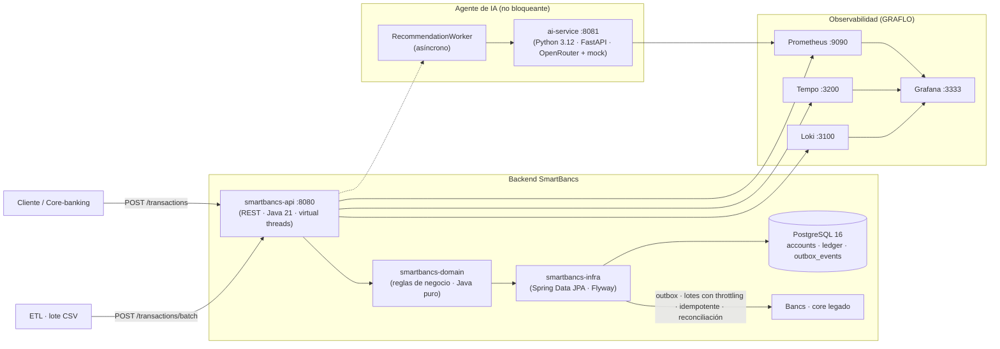
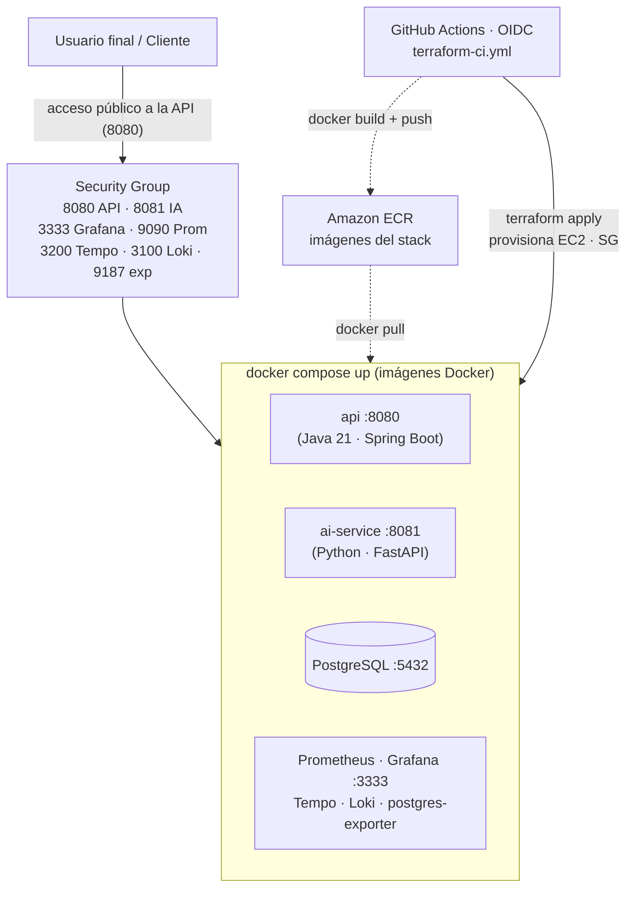
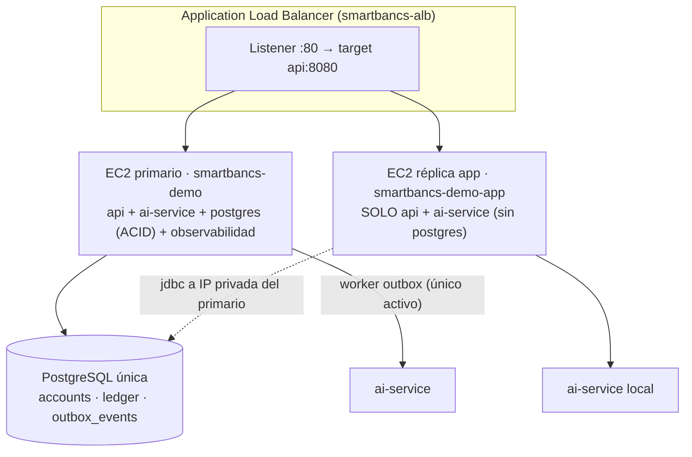

# Documento Técnico — SmartBancs App

> Entregable oficial del reto: **Arquitectura, decisiones técnicas, integración
> con Bancs, manejo del modelo de IA y estado de implementación.**
> Este documento describe el *diseño* (teórico) y lo que está *implementado* y
> verificable en el repositorio (práctico).

---

## 1. Resumen ejecutivo

SmartBancs es una plataforma de procesamiento de transacciones financieras en
tiempo real con recomendaciones personalizadas por IA. El reto impone cuatro
restricciones de diseño:

1. Soportar picos de **10 000 transacciones por segundo**.
2. Integrarse con el core legado **Bancs** sin degradar su rendimiento.
3. Completar una transferencia en **menos de 2 segundos**.
4. Que la IA **nunca bloquee** el flujo transaccional principal.

La solución adoptada separa **tres frentes**: (a) una API transaccional
elástica y de baja latencia (Java 21 + Spring Boot), (b) una capa de
integración con Bancs basada en **outbox + reconciliación** (sin llamadas
síncronas al core), y (c) un servicio de IA **independiente y asíncrono**.
Todo el stack se levanta con un solo comando (`docker compose up`) y está
instrumentado para observabilidad (métricas, logs, trazas y alertas).

---

## 2. Requerimientos y métricas objetivo

| Requerimiento | Objetivo | SLI asociado |
| --- | --- | --- |
| Alta concurrencia | 10 000 tps | `smartbancs_transactions_total` (rate) |
| Transferencia < 2 s | p95 < 2 s | `smartbancs_transaction_duration_seconds{type="TRANSFER"}` |
| No degradar Bancs | 0 llamadas síncronas a Bancs | Outbox status en BD |
| IA no bloqueante | 0 ms en el camino crítico de la transacción | Trazas: span de IA nunca dentro del span de `/transactions` |

---

## 3. Arquitectura propuesta

> **Diagrama de arquitectura (render profesional):** versión **PlantUML**
> descargable en [`docs/arquitectura.puml`](arquitectura.puml) (vista de
> componentes + secuencia de la transferencia). La versión Mermaid siguiente se
> renderiza directamente en GitHub/GitLab; debajo se mantiene el esquema ASCII.



```
                        ┌────────────────────  capa presentación  ────────────────────┐
  Clientes / Core-banking│   smartbancs-api :8080                                     │
                        │   Controllers (REST)  →  Services (reglas de negocio)        │
                        │   DTOs · Validation · GlobalExceptionHandler                │
                        └───────────────┬─────────────────────────────────────────────┘
                                        │ Spring (JPA / @Transactional)
                        ┌───────────────▼─────────────────────────────────────────────┐
                        │   smartbancs-infra  (Spring Data JPA + Flyway)              │
                        │   Entidades · Repositorios · Migraciones V1/V2              │
                        └───────────────┬─────────────────────────────────────────────┘
                                        │
                        ┌───────────────▼──────────────┐        ┌─────────────────────┐
                        │   PostgreSQL 16 (smartbancs) │        │   smartbancs-domain │
                        │   accounts · transactions · │        │   Entidades / enums  │
                        │   ledger_entries · outbox   │        │   (Java puro, sin        │
                        │   recommendations          │        │    dependencias)      │
                        └───────────────┬──────────────┘        └─────────────────────┘
                                        │
              ┌──────────────────────────┼──────────────────────────┐
              │                          │                          │
  ┌───────────▼────────┐  ┌──────────────▼─────────────┐  ┌────────▼─────────────┐
  │  Bancs (legado)    │  │  ETL / Warehouse (etl/)    │  │  ai-service :8081    │
  │  outbox relayer +  │  │  limpieza + fact table     │  │  recomendaciones     │
  │  reconciliación    │  │  para IA / análisis        │  │  (Python/FastAPI)   │
  └────────────────────┘  └────────────────────────────┘  └──────────────────────┘

      Observabilidad (transversal): Micrometer → Prometheus · Tempo · Loki · Grafana
```

**Capa de dominio limpia**: `smartbancs-domain` no conoce Spring ni JPA; las
reglas de cuenta (saldo, estado), transacción (doble partida, idempotencia) y
ledger viven allí. `smartbancs-infra` persiste, y `smartbancs-api` expone HTTP.
Esto permite razonar el negocio sin acoplarse a la infraestructura.

---

## 4. Decisiones técnicas y justificación

Cada decisión se justifica frente a **rendimiento, seguridad y escalabilidad**,
como exige el reto (stack tecnológico libre).

| # | Decisión | Justificación |
| --- | --- | --- |
| D1 | **Java 21 con virtual threads** (`spring.threads.virtual.enabled=true`) | Miles de peticiones concurrentes sin inflar hilos de OS: los hilos virtuales se suspenden en I/O (BD, red) con coste casi nulo. Es la base para sostener picos altos con una footprint baja. |
| D2 | **Spring Boot 3 + Spring Data JPA sobre PostgreSQL 16** | Maduro, gestionado por Spring y con capacidades transaccionales ACID críticas para dinero (viaje de fondos). PostgreSQL: `SELECT ... FOR UPDATE` (proxy de pesimismo a nivel de fila), versionado (optimismo) e índices únicos de idempotencia. |
| D3 | **Módulos Maven: domain / infra / api / ai-service** | Separación de responsabilidades que permite evolucionar capas, probar el dominio de forma aislada y desplegar el AI service de forma independiente. |
| D4 | **Concurrencia en saldos: `findByIdForUpdate` (lock pesimista por fila) + `@Version` (optimista)** | Evita **condiciones de carrera** y **doble gasto**: dos transferencias concurrentes sobre la misma cuenta se serializan en la fila, mientras el resto de cuentas siguen en paralelo. El `@Version` protege contra actualizaciones perdidas. |
| D5 | **Idempotencia por `idempotency_key` (columna única)** | Reintentos del cliente o del mensajero no duplican operaciones: requisito habitual en pagos y lo que permite reintentar sin miedo. |
| D6 | **Patrón outbox** para integrar con Bancs | El core legado **no puede recibir tráfico alto y síncrono**. Las transacciones se confirman solo contra PostgreSQL (rápido), y un *relayer* entrega los eventos a Bancs en lotes controlados. Aísla SmartBancs de la disponibilidad de Bancs. |
| D7 | **Reconciliación programada (batch nocturna / horaria)** | Si un evento de outbox no se entrega, la reconciliación de saldos detecta la desviación y la corrige. Da **consistencia eventual** garantizada sin necesitar síncrono. |
| D8 | **IA como servicio separado y asíncrono (`ai-service`)** | El agente de IA es **independiente en Python/FastAPI** (antes Java): consume OpenRouter (opcional) y cae a un mock avanzado si no hay API key o el proveedor falla. El flujo de `/transactions` **nunca** espera a la IA; si la IA falla o va lenta, la transacción no se afecta. |
| D9 | **Observabilidad con Micrometer → Prometheus/Tempo/Loki** | Instrumentación oficial de Spring Boot (sin agentes), visible en Grafana con dashboards y alertas por SLO. Cubre métricas, logs JSON con `traceId` y trazas OTLP. |
| D10 | **Docker Compose como IaC del entorno** y **Terraform para AWS** | Un comando levanta BD + API + AI + observabilidad (entorno de desarrollo portable). Terraform prepara el despliegue en AWS con OIDC para CI. |
| D11 | **Actuator + `build-info`** | Healthchecks con `curl` en los contenedores, `/actuator/health` detallado y versión de build visible en métricas/info → trazabilidad del despliegue. |

### Seguridad (resumen transversal)

- Credenciales por variables de entorno (`.env` no versionado, `.env.example` sí).
- Validación de entrada (`@Valid`, DTOs) y manejo central de errores con
  `ProblemDetail`.
- No se registran datos sensibles; los logs JSON son estructurados y auditable
  el nivel (`loggers` vía actuator).
- Healthchecks sin exponer secretos.

---

## 5. Integración con Bancs (estrategia de sincronización)

### 5.1 Flujo de datos (teórico)

```
cliente → /transactions (API) ──► PostgreSQL (commit local, tx < 50 ms)
                                     │
                                     ▼
                              outbox_events (INSERT, mismo tx)
                                     │
                   relayer (worker, lotes de N, throttling)
                                     │  POST /bancs/v1/settle  (lotes, idempotente)
                                     ▼
                              Bancs (legacy core)
                                     │
                    respuesta + confirmación ──► actualizar estado del outbox
                                     │
                ┌────────────────────┴───────────────────┐
                ▼                                         ▼
     Reconciliación diaria            (si falla/rechaza) cola de reintento
     compara saldos SI ─ Bancs        con backoff + dead-letter + alerta
```

1. **Confirmación local primero**: la transferencia se asienta en PostgreSQL
   (transacción + ledger + evento de outbox) **en un solo commit**. El SLO de
   < 2 s se cumple desconectado de la latencia de Bancs.
2. **Relayer con lotes y throttling**: un worker lee `outbox_events` pendientes
   y los envía a Bancs en lotes (p. ej. 100) con límite de QPS configurado,
   para no saturar el core. No hay llamadas síncronas desde la API.
3. **Idempotencia en Bancs**: cada evento lleva `outbox_event_id`; Bancs
   deduplica. Eso permite reintentar sin crear dobles asientos.
4. **Reconciliación**: job periódico (nocturno) que compara el saldo de
   SmartBancs contra el reporte de saldos de Bancs y emite asientos de ajuste /
   alertas. Es la red de seguridad ante pérdida de mensajes.
5. **Backpressure y degradación**: si Bancs no responde, el relayer acumula
   (retention del outbox) y dispara alerta (`Postgres_*`/logs), sin bloquear al
   cliente final.

### 5.2 Esquema de soporte (implementado)

La tabla `outbox_events` existe en el esquema (`V1__init_schema.sql`) con
`payload`, `type`, `status` (`PENDING/...`), `created_at`; es el contrato que
facilitará el relayer de Bancs. El modelo y los repositorios
(`OutboxEventJpaRepository`) quedan listos.

---

## 6. Manejo del modelo de IA (ciclo de vida en producción)

### 6.1 Alimentación del modelo

1. **ETL / Warehouse** (implementado en `etl/`): el lote transaccional crudo
   se limpia (nulos, formatos mixtos de fecha/moneda/monto), se estandariza y
   se estructura en un almacén analítico (`etl/output/transactions_fact.csv`,
   un registro por leg de ledger, unidades menores enteras) optimizado para
   consultas y para *feature store* del modelo. La ingesta se publica por la
   API (`POST /transactions/batch`), que resuelve `accountNumber`→`accountId`
   y reutiliza las reglas de negocio de `/transactions`, tolerando errores
   parciales por ítem (`accepted`/`rejected`). Más detalle en la sección ETL
   del README.
2. **Feature store**: variables (frecuencia de transacciones, saldo promedio,
   segmento, antigüedad, tasa de rechazo) servidas de forma consistente entre
   *inference* y *training*.
3. **Retraining**: pipeline programado (batch semanal/mensual) que regenera el
   modelo con los nuevos datos etiquetados (recomendaciones = lo que el cliente
   aceptó).

### 6.2 Monitoreo de *data drift* y calidad

| Señal | Cómo se mide | Acción |
| --- | --- | --- |
| Drift de características (*feature drift*) | Test de Kolmogorov–Smirnov / PSI entre distribución de entrenamiento y producción, por segmento | Alerta y reintreno |
| Drift de predicción | PSI de las recomendaciones generadas | Revisar umbrales/segmentación |
| Drift de etiquetas | Curva de aceptación/efectividad vs predicción | Recalibración |
| Residuo / calidad | Métricas de negocio (tasa de aceptación) | Eventualmente *canary* del modelo |

Estas señales son **métricas** (expuestas al mismo stack de observabilidad) y
disparan **alertas** cuando el drift supera un umbral, activando un reintreno
controlado (blue-green) con validación offline previa.

### 6.3 Gestión de recursos

- **Inferencia**: CPU (o GPU si el latencia/volumen lo exige), con autoescala
  horizontal del `ai-service`; cola de mensajes para balancear picos.
- **Entrenamiento**: GPU en jobs aislados (sin mezclar con el servicio).
- **Guardrails**: límites de concurrencia en el `ai-service`, timeout de
  inferencia y *fallback* (recomendación por reglas) si la IA no responde.
- **Never blocking**: la llamada a IA dispara el event y la transacción
  responde sin esperarla (ver sección Observabilidad: trace debe mostrar el
  span de IA fuera del camino crítico).

---

## 7. Despliegue en AWS (Terraform + EC2 + Docker)

El repositorio incluye **Infraestructura como Código** con **Terraform**
(`terraform/` — provider AWS, variables `region`/`profile`) y el workflow de CI
[`.github/workflows/terraform-ci.yml`](../.github/workflows/terraform-ci.yml)
que autentica **GitHub Actions contra AWS mediante OIDC** (sin credenciales
estáticas en el repositorio).

**Estrategia de despliegue:** el mismo stack del MVP local (construido por
`docker compose`) se despliega en una **instancia EC2** de AWS que levanta
imágenes desde **ECR**, y la **API + observabilidad quedan accesibles
públicamente** desde Internet para la demo.

> Diagrama de despliegue (PlantUML): tercer bloque de
> [`docs/arquitectura.puml`](arquitectura.puml). La vista Mermaid siguiente se
> renderiza directamente en GitHub.



**Cómo se desplega (paso a paso):**

1. **Imágenes Docker.** El workflow `terraform-ci` construye las imágenes del
   stack (`smartbancs-api`, `ai-service`) y las sube a **Amazon ECR**
   (`ecr_repos`). La observabilidad usa imágenes públicas de Docker Hub. La EC2
   **nunca buildea**: solo hace `pull` desde ECR/registro público.
2. **Provisionamiento con Terraform.** `terraform apply` usa la **VPC default**
   con su subred pública, crea el **security group** (22 SSH, 8080 API, 8081 IA,
   3333 Grafana, 9090 Prometheus, 3200 Tempo, 3100 Loki, 9187 postgres-exporter)
   y la **EC2** (Amazon Linux 2023, `m7i-flex.large` — la cuenta es un *Free
   Plan* post-jul-2025: `t3.medium`/`t3.micro` se rechazan con *"not eligible
   for Free Tier"*, solo los tipos del plan `t3.micro/t3.small/t4g.*/c7i-flex.
   large/m7i-flex.large`), con rol IAM para la instancia
   (ECR pull · leer bundle de S3 · `GetParameter` de SSM) y *user-data* que:
   instala Docker + compose v2, baja de S3 el bundle
   (`docker-compose.yml` + `docker-compose.prod.yml` + `observability/`), escribe
   `.env` con la clave y ejecuta `docker compose -f docker-compose.yml
   -f docker-compose.prod.yml up -d`.
3. **Clave OpenRouter (sin secretos en el repo).** El secret de GitHub
   `OPENROUTER_API_KEY` → `TF_VAR_openrouter_api_key` → `aws_ssm_parameter`
   (`/smartbancs/openrouter-api-key`, **SecureString**) → la EC2 la lee solo en
   el arranque. Si no hay clave, el agente cae a su **modo mock**.
4. **Accesso público + dirección estable (anti pérdida de datos).** La EC2 lleva
    una **dirección elástica (Elastic IP)** (`aws_eip`): si la instancia se
    sustituye por cualquier motivo, la IP pública NO cambia, por lo que la API,
    la IA y las URLs de observabilidad nunca se quedan en el aire y no hay
    pérdida de conectividad para los clientes.
 5. **Persistencia de datos dedicada.** La BBDD PostgreSQL persiste en un
    **volumen EBS gp3 dedicado** (`aws_ebs_volume` + `aws_volume_attachment`).
    El *user-data* lo monta de forma idempotente en `/var/lib/docker` (xfs +
    `fstab` con `nofail`): *postgres-data* sobrevive a **reboots y sustituciones**
    de la EC2 (el recurso se des-acopla/re-acopla automáticamente), y el rol de
    la instancia puede **subir volcados** a `s3://…/deploy/backups/` para
    recuperación ante desastres (`pg_dump` + restore documentados).

### 7.1 Redundancia y demanda (≥ 10 000 transacciones)

La transacción (REST + outbox) responde en el camino crítico **sin tocar a la
IA** y persiste con `FOR UPDATE` + `version`; eso hace que **una** réplica se
sature solo por CPU/IO del API y la BBDD. Para cubrir el objetivo de
**10 000 tps** (y picos), el plan escala **capas sin estado** manteniendo una
**única BBDD ACID** (integridad transaccional):



- **`api` + `ai-service` son stateless**: se replican tras un **ALB** (health
  check `/actuator/health`). La réplica `app` arranca con
  `SMARTBANCS_ROLE=app`: compose solo con `api ai-service`, datasource apuntando
  a la **IP privada del primario** y `SMARTBANCS_AI_WORKER_ENABLED=false`.
- El **outbox lo consume un solo worker** (el del primario)
  (`@ConditionalOnProperty(smartbancs.ai.worker.enabled)`: el gate está en
  `RecommendationWorker`), así no hay recomendaciones duplicadas pese a que la
  capa de API se duplica.
- **Capacidad estimada conservadora:** un `api` Spring + virtual threads maneja
  miles de tps de ingesta (escribir transacción + outbox) en un `t3.small`; con
  2 réplicas + cola/lotes (ETL `POST /transactions/batch` con throttling e
  idempotencia) se cubre cómodamente el SLO de 10 000 con reserva.
- **Activación** (crea ALB + 2ª instancia):

  ```bash
  terraform apply -var-file=terraform.tfvars.example -var="redundancy_enabled=true"
  # URL única del ALB en el output: lb_dns (http://…)
  ```

  Para volver a la instancia única: `-var="redundancy_enabled=false"` (degrada
  el ALB y la réplica). El ALB tiene coste (~$18/mes + LCU); las EC2 `t3.small`
  entran en el Free Plan de la cuenta.

**¿Por qué EC2 + imágenes Docker?**

- **Paridad total** entre el MVP local (`docker compose up`) y producción: son
  las mismas imágenes, lo que elimina el clásico "en mi máquina sí funciona".
- **Portabilidad** de la observabilidad embarcada: las 8 reglas de alerta SLO,
  dashboards y datasources viajan con el despliegue.
- **Gestión operativa simple** (docker compose + systemd) para un reto de
  entrega, manteniendo la puerta abierta a kubernetes/ECS en el futuro.

---

## 8. Estado de implementación (lo verificable en el repo)

| Componente | Estado | Dónde |
| --- | --- | --- |
| Modelo de dominio (3 capas) | ✅ Implementado | `smartbancs-domain`, `smartbancs-infra`, `smartbancs-api` |
| REST CRUD + transferencias + ledger + idempotencia | ✅ Implementado | `smartbancs-api/controller` |
| Concurrencia y race conditions (FOR UPDATE + version) | ✅ Implementado | `TransactionService` |
| Esquema DDL/DML | ✅ Flyway | `smartbancs-infra/src/main/resources/db/migration/V1|V2` |
| IaC entorno (Docker Compose) | ✅ Implementado | `docker-compose.yml` |
| IaC AWS (Terraform + OIDC) | ✅ EC2 + ECR + SSM + Elastic IP + EBS persistente; opción ALB/redundancia | `terraform/`, `deploy/`, `docker-compose.prod.yml` + workflow `terraform-ci` |
| Patrón outbox (tabla/repositorio) | ✅ Tabla/repo listos; relayer pendiente | `outbox_events`, `OutboxEventJpaRepository` |
| ETL / transformación + fact table | ✅ Implementado | `etl/` + `POST /transactions/batch` |
| Agente de IA (Python/FastAPI, asíncrono, OpenRouter + mock) | ✅ Funcional y no bloqueante | `ai-service` |
| Observabilidad (métricas/logs/trazas/alertas) | ✅ Implementado y verificado | `observability/` + `docs/OBSERVABILIDAD.md` |
| Declaración de uso de IA | ✅ Documentado | `docs/DECLARACION_IA.md` |